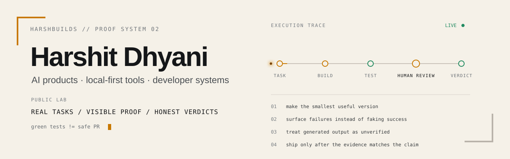

<picture>
  <source media="(prefers-color-scheme: dark)" srcset="./assets/profile-hero-v2-dark.svg">
  <source media="(prefers-color-scheme: light)" srcset="./assets/profile-hero-v2-light.svg">
  
</picture>

<p align="center">
  <a href="https://x.com/HarshBuilds_1">field notes</a>
  &nbsp;·&nbsp;
  <a href="https://github.com/Harshit-Dhyani?tab=repositories">public builds</a>
  &nbsp;·&nbsp;
  <a href="https://github.com/Harshit-Dhyani/pcmon">current public ship</a>
</p>

## 01 / live build signals

<picture>
  <source media="(prefers-color-scheme: dark)" srcset="./assets/live-builds-dark.svg">
  <source media="(prefers-color-scheme: light)" srcset="./assets/live-builds-light.svg">
  
</picture>

<sub>Generated from my original public repositories. The profile repo and forks are excluded; the panel refreshes through GitHub Actions when the underlying public signals change.</sub>

---

## 02 / three builds that explain me better than a tech-stack wall

### [pcmon](https://github.com/Harshit-Dhyani/pcmon)

`Windows → PowerShell collectors → localhost API → plain browser dashboard`

A local-first Windows diagnostics tool. The interesting part is not another monitoring dashboard; it is the decision to expose **unsupported, stale, warming, missing, and error states** instead of quietly turning uncertainty into fake zeroes. Process actions require explicit confirmation and protected system processes are blocked.

### [Tessera Gateway](https://github.com/Harshit-Dhyani/Tessera-Gateway)

`tool / MCP client → local runtime → provider BrowserView → real provider UI`

A Windows-first local AI gateway for controlling multiple provider web sessions from one runtime. If a provider requires login or its page changes, Tessera reports that state instead of pretending the prompt succeeded.

### [OpenWispr](https://github.com/Harshit-Dhyani/OpenWispr)

`audio → local STT → optional local refinement → transcript / session artifacts`

A privacy-first Windows speech-to-text experiment with real-time transcription, local models, system-audio capture, and local LLM refinement. It is **WIP**, has known bugs, and I would rather say that clearly than dress it up as finished software.

---

## 03 / the rules behind the builds

```text
claim matters       -> show evidence
failure can happen  -> surface the state
AI wrote it         -> still unverified
risk is meaningful  -> keep a human approval boundary
scope is expanding  -> prove one vertical slice first
data can stay local -> prefer local-first when the trade-off makes sense
```

I use AI heavily. I do not outsource judgment to it.

---

## 04 / what I am getting better at

```text
AI systems       agents · RAG · evaluation · tool use · local models
product          useful UX · activation · reliability · distribution
engineering      system design · security boundaries · observability · debugging
foundations       deeper CS · data structures · algorithms · systems thinking
```

<details>
<summary><b>toolbox — only if you actually care</b></summary>
<br />

```text
languages   TypeScript · JavaScript · Python · Java · C++
frontend    React · Next.js · Tailwind · Vite · Electron
backend     Node.js · Express · FastAPI · Flask · Prisma
data        PostgreSQL · MongoDB · Supabase
systems     Docker · Git/GitHub · Windows/PowerShell · VPS
```

The stack is not the identity. It changes with the problem.

</details>

---

## 05 / HarshBuilds

**HarshBuilds is my public builder lab:** real tasks, visible proof, honest verdicts.

I am building a body of work around coding agents, AI product reliability, security boundaries, local-first software, SaaS experiments, and the gap between **"the demo worked"** and **"I would trust this in a real workflow."**

I write the field notes on **[@HarshBuilds_1](https://x.com/HarshBuilds_1)**.

<sub>17 · self-taught · building software since 2022 · next test should be harder to fool</sub>
