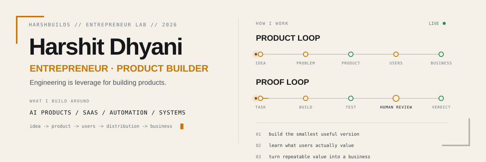
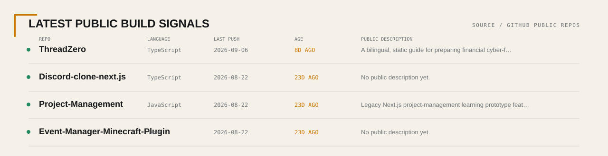

<picture>
  <source media="(prefers-color-scheme: dark)" srcset="./assets/profile-hero-v3-dark.svg">
  <source media="(prefers-color-scheme: light)" srcset="./assets/profile-hero-v3-light.svg">
  
</picture>

<p align="center">
  <a href="https://x.com/HarshBuilds_1">HarshBuilds field notes</a>
  &nbsp;·&nbsp;
  <a href="https://github.com/Harshit-Dhyani?tab=repositories">public builds</a>
  &nbsp;·&nbsp;
  <a href="https://github.com/Harshit-Dhyani/pcmon">current public ship</a>
</p>

## 00 / who I am

I'm **Harshit Dhyani** — 17, an **entrepreneur, product builder, and self-taught technical builder**.

I started programming in **2022** because I wanted the ability to turn ideas into real things instead of waiting for somebody else to build them. Engineering is leverage for me: a way to create products, test assumptions, automate work, and understand what is actually possible.

The part I care about most is the whole loop:

```text
problem → user → product → distribution → business
```

I want to get good at both sides: **building the product** and **making the product matter**.

---

## 01 / entrepreneur mode

```text
BUILDING      AI products · SaaS experiments · automation · local-first tools
THINKING      users · painful problems · product value · business models
LEARNING      distribution · sales · communication · AI · deeper CS
IMPROVING     product judgment · execution speed · reliability · clarity
LONG GAME     build products and businesses that create real value
```

I don't want to collect projects forever. I want to understand how an idea becomes something people choose, use, pay for, recommend, and keep using.

---

## 02 / public build log

<picture>
  <source media="(prefers-color-scheme: dark)" srcset="./assets/live-builds-dark.svg">
  <source media="(prefers-color-scheme: light)" srcset="./assets/live-builds-light.svg">
  
</picture>

<sub>Generated from my original public repositories. The profile repo and forks are excluded; GitHub Actions refreshes the panel when the underlying public signals change.</sub>

---

## 03 / products & experiments

### [pcmon](https://github.com/Harshit-Dhyani/pcmon)

**Problem:** Windows diagnostics are fragmented, and monitoring tools can make uncertain data look more trustworthy than it is.

**Product:** A local-first Windows diagnostics tool that brings CPU, memory, disk, GPU, processes, services, startup items, snapshots, reports, and safe process actions into one browser dashboard.

**What it taught me:** good products should communicate uncertainty honestly. `unsupported`, `stale`, `warming`, `missing`, and `error` are better states than a fake zero.

`PowerShell collectors → localhost API → browser dashboard`

---

### [Tessera Gateway](https://github.com/Harshit-Dhyani/Tessera-Gateway)

**Problem:** AI providers live across separate interfaces, sessions, and login states.

**Experiment:** Can one local system coordinate those interfaces through a browser UI, local HTTP API, and MCP server without pretending provider-owned boundaries do not exist?

**What it taught me:** automation needs honest failure states. Login required, provider unavailable, UI changed, and timeout are product states—not details to hide.

`tool / MCP client → local runtime → provider BrowserView → real provider UI`

---

### [OpenWispr](https://github.com/Harshit-Dhyani/OpenWispr)

**Problem:** speech-to-text often creates a privacy trade-off by sending audio and transcripts to cloud services.

**Experiment:** A Windows-first transcription system built around local speech models, real-time audio capture, local refinement, and session artifacts.

**Current state:** **WIP / active experiment.** It has known bugs and unfinished areas. I would rather show that than turn an unfinished build into fake portfolio polish.

`audio → local STT → optional local refinement → transcript / session artifacts`

---

## 04 / right now

### Building

- AI products and SaaS experiments
- automation and local-first tools
- systems that solve a real workflow instead of only demonstrating a technology
- public experiments under HarshBuilds

### Learning

- AI systems, agents, RAG, tool use, evaluation, and local models
- product strategy, validation, pricing, distribution, and retention
- system design, security boundaries, observability, and debugging
- deeper computer-science fundamentals

### Practicing

- shipping smaller versions faster
- cutting scope before complexity becomes the project
- explaining products clearly
- separating assumptions from evidence
- turning technical work into user and business value

---

## 05 / how I think

```text
understand the problem
        ↓
understand the user
        ↓
build the smallest useful product
        ↓
ship + observe
        ↓
learn what actually matters
        ↓
improve or change direction
```

And the mental model I keep coming back to:

```text
CODE         = LEVERAGE
PRODUCT      = VALUE
DISTRIBUTION = REACH
BUSINESS     = SYSTEM
```

My engineering rules still matter because they protect the product:

```text
claim matters       → show evidence
failure can happen  → surface the state
AI generated it     → still verify it
risk is meaningful  → keep human approval
scope is exploding  → cut it or prove one vertical slice first
```

I use AI heavily. I don't outsource judgment to it.

---

## 06 / beyond code

| Layer | Question I'm learning to answer |
| --- | --- |
| **Product** | What should actually exist? |
| **Customers** | Who has the problem strongly enough to care? |
| **Validation** | What evidence proves the problem or the solution? |
| **Distribution** | How will the right people discover it? |
| **Sales** | Why would somebody choose or pay for it? |
| **Retention** | Why would they continue using it? |
| **Operations** | How does the value get delivered repeatedly? |

Technical ability helps me create the product. **Entrepreneurship is everything required to make that product matter.**

---

## 07 / technical toolkit

<details>
<summary><b>expand the tools I build with</b></summary>
<br />

```text
languages   TypeScript · JavaScript · Python · Java · C++
frontend    React · Next.js · Tailwind · Vite · Electron
backend     Node.js · Express · FastAPI · Flask · Prisma
data        PostgreSQL · MongoDB · Supabase
systems     Docker · Git/GitHub · Windows/PowerShell · VPS
ai          LLM APIs · RAG · agents · local models · evaluation workflows
```

I learn tools because they help me build products. **The stack is not the identity.**

</details>

---

## 08 / HarshBuilds

**HarshBuilds is my public entrepreneur + builder lab:** real tasks, visible proof, honest verdicts.

I'm building a body of work around:

- AI products and coding agents
- SaaS and product experiments
- startup ideas and validation
- distribution and product lessons
- AI security and reliability boundaries
- local-first software
- what broke, what required human judgment, and what was actually worth using

The goal is not to look like I already know everything. The goal is to **build, test, learn, and leave useful evidence behind**.

I write the field notes on **[@HarshBuilds_1](https://x.com/HarshBuilds_1)**.

<sub>17 · entrepreneur · self-taught technical builder · building software since 2022</sub>
