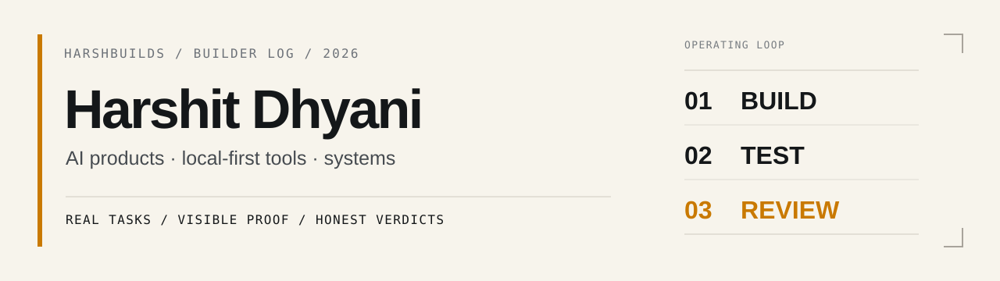

<picture>
  <source media="(prefers-color-scheme: dark)" srcset="./assets/profile-banner-dark.svg">
  <source media="(prefers-color-scheme: light)" srcset="./assets/profile-banner-light.svg">
  
</picture>

<br />

## 00 / hello

I'm **Harshit Dhyani** — 17, self-taught, and building software since 2022.

I work on **AI products, local-first tools, developer infrastructure, and automation**. I care more about what survives a real task than what looks impressive in a demo.

**HarshBuilds is the public lab:** real tasks, visible proof, honest verdicts.

[Follow the build log on X](https://x.com/HarshBuilds_1) · [Browse my public repositories](https://github.com/Harshit-Dhyani?tab=repositories)

---

## 01 / now

```text
BUILDING     AI product engineering + local-first tools
LEARNING     AI systems, evaluation, system design, deeper CS fundamentals
OPTIMIZING   reliability, security boundaries, useful UX, shipping speed
DOCUMENTING  coding agents, builder workflows, failures, trade-offs, lessons
```

The loop I try to follow:

```text
problem → smallest useful build → runtime evidence → review → improve
```

---

## 02 / selected public builds

| Project | What it is | Current emphasis |
| --- | --- | --- |
| **[pcmon](https://github.com/Harshit-Dhyani/pcmon)** | Local-first Windows diagnostics in PowerShell with a lightweight browser dashboard. | Truthful collector states, safe process actions, snapshots, zero cloud dependency. |
| **[Tessera Gateway](https://github.com/Harshit-Dhyani/Tessera-Gateway)** | Windows-first local AI gateway that controls provider web sessions through one runtime, local HTTP API, and MCP server. | Explicit provider state, browser automation, local orchestration, honest failure modes. |
| **[OpenWispr](https://github.com/Harshit-Dhyani/OpenWispr)** | Privacy-first Windows desktop speech-to-text with local transcription and local LLM refinement. | Real-time audio, offline processing, dual transcription modes. **WIP.** |
| **[tidysort](https://github.com/Harshit-Dhyani/tidysort)** | Small Python CLI for organizing files by extension, size, date, or name. | Simple automation with undo support. |

I also keep learning repos and experiments public when they are useful as a record, not just as portfolio decoration.

---

## 03 / toolbox

```text
languages   TypeScript · JavaScript · Python · Java · C++
frontend    React · Next.js · Tailwind · Vite · Electron
backend     Node.js · Express · FastAPI · Flask · Prisma
 data       PostgreSQL · MongoDB · Supabase
systems     Docker · Git/GitHub · Windows/PowerShell · VPS
ai          LLM APIs · RAG · agents · local models · evaluation workflows
```

I don't treat this as a checklist. The stack changes with the problem.

---

## 04 / build rules

```text
if a claim matters      → show evidence
if a failure can happen → surface the state
if an action is risky   → keep a human approval boundary
if data can stay local  → prefer local-first when it makes sense
if scope keeps growing  → prove one vertical slice before expanding
```

I use AI heavily, but I don't treat generated output as proof that something works.

---

## 05 / HarshBuilds field notes

I'm building a public body of work around:

- coding agents on real engineering tasks
- AI product and workflow reliability
- AI security boundaries for builders
- local-first software
- SaaS/product experiments
- what broke, what needed human review, and what was actually worth using

The goal is not to become an AI-news feed. It's to build, test, and leave useful evidence behind.

**X:** [@HarshBuilds_1](https://x.com/HarshBuilds_1)

---

<sub>Build → test → review → ship. Then make the next version harder to fool.</sub>
